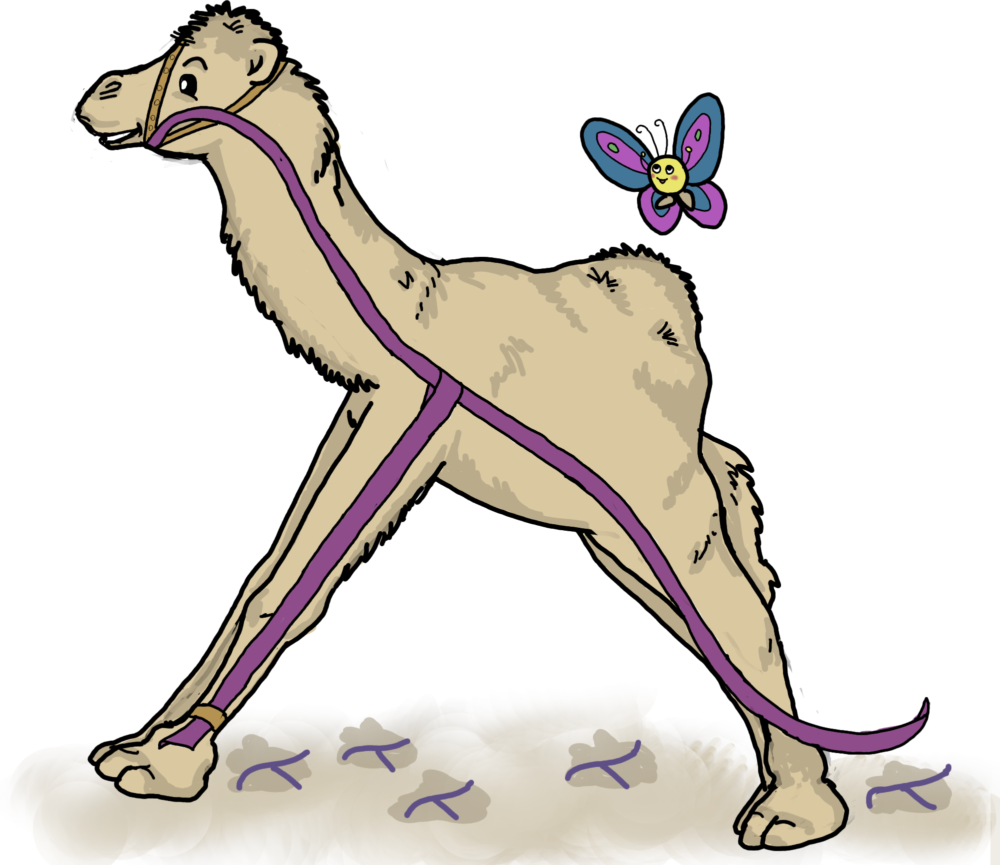

# A retrospective on Pugs, the experimental Perl 6 platform of 2005 and 2006

A tale of lambdacamels optimizing for fun and writing Perl 6, Haskell, and
poetry.

**Abstract.** "Hi. Today I have started working on specifying and implementing
Featherweight Perl 6 (FP6), a side-effect-free subset of Perl 6." Audrey Tang
used these words to unveil the Pugs project in February of 2005. Initially
conceived as an implementation of a small subset of Perl 6 in Haskell, the
project quickly grew to contain a full-fledged compiler and interpreter for
Perl 6 and attracted a large and diverse community.

The talk will give a subjective survey of the history of Pugs. We will pay
particular attention to the special manner with which Audrey led the project
and what the philosophy *-Ofun* meant to the developers. We'll also discuss
which parts of Pugs were absorbed into other implementations of Perl 6 and
which influence Pugs had on the Perl and Haskell communities.

**About me.** I contributed to Pugs as a school student in 2005, at first by
porting modules and writing tests, then gradually also by writing Haskell code
and later by implementing a JavaScript backend. Audrey and the unique spirit in
the Pugs community had a strong and lasting influence on me (exposing me to
Haskell, category theory, and a beautiful way of tending communities); I look
back on very exciting and fun days.

**Warning.** The account is mostly from memory and not properly researched. Try
not to trust it! Also note that the timeline covers only the year 2005 and that
*the code excerpts are edited for legibility*, i.e. shortened at a few places
and not reproduced verbatim. Pull requests are very much welcome; in fact, in
good old Pugs spirit you will get full write access to the repository so you
can merge them yourself.
